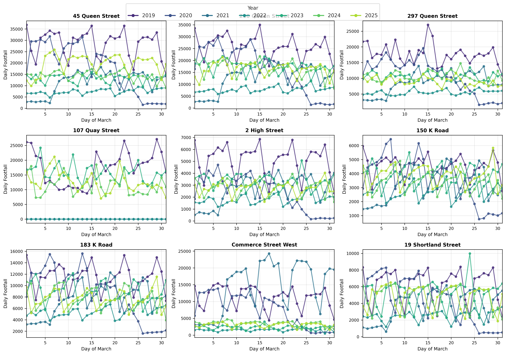
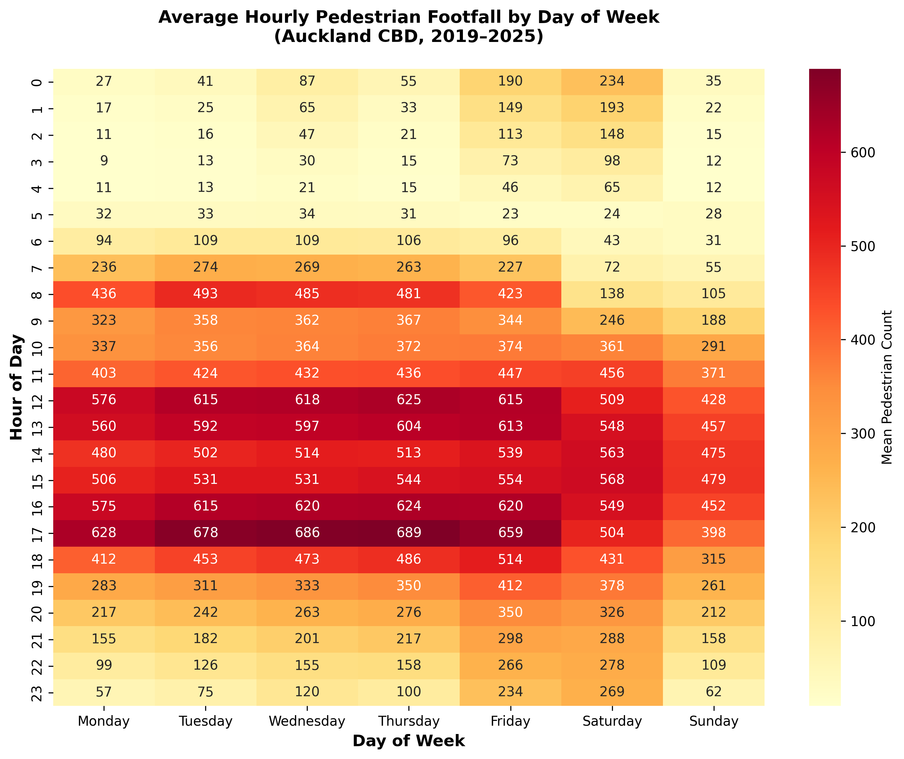
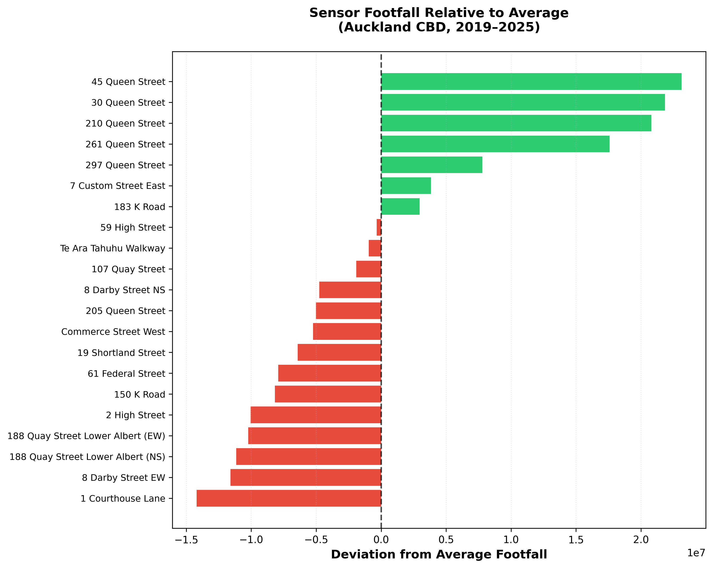

# akl-ped-counts

[](https://pypi.org/project/akl-ped-counts/)
[](https://pypi.org/project/akl-ped-counts/)
[](https://creativecommons.org/licenses/by/4.0/)

Hourly pedestrian count data from [Heart of the City Auckland](https://www.hotcity.co.nz/pedestrian-counts)'s pedestrian monitoring system, covering **21 sensor locations** across Auckland CBD from **2019 to 2025**.

---

## Building and publishing with uv

### Prerequisites

Install [uv](https://docs.astral.sh/uv/getting-started/installation/) if you haven't already:

```bash
# macOS / Linux
curl -LsSf https://astral.sh/uv/install.sh | sh

# Windows
powershell -ExecutionPolicy ByPass -c "irm https://astral.sh/uv/install.ps1 | iex"
```

You will also need accounts on both [TestPyPI](https://test.pypi.org/account/register/) and [PyPI](https://pypi.org/account/register/), each with an API token generated from **Account Settings → API tokens**.

### Step 1: Build the package

```bash
cd akl-ped-counts
uv build
```

This creates two files in `dist/`:

```
dist/
├── auckland_pedestrian-0.1.0-py3-none-any.whl
└── auckland_pedestrian-0.1.0.tar.gz
```

### Step 2: Publish to TestPyPI

Always test on [TestPyPI](https://test.pypi.org/) first:

```bash
uv publish --publish-url https://test.pypi.org/legacy/
```

uv will prompt for your credentials. Use `__token__` as the username and paste your TestPyPI API token as the password. Alternatively, set the token via an environment variable:

```bash
export UV_PUBLISH_TOKEN=pypi-AgEI...   # your TestPyPI token
uv publish --publish-url https://test.pypi.org/legacy/
```

### Step 3: Verify the TestPyPI install

```bash
# Create a throwaway venv and install from TestPyPI
uv venv /tmp/test-install
source /tmp/test-install/bin/activate

# --extra-index-url ensures pandas is pulled from real PyPI
uv pip install \
  --index-url https://test.pypi.org/simple/ \
  --extra-index-url https://pypi.org/simple/ \
  akl-ped-counts

# Smoke test
python -c "
from auckland_pedestrian import load_hourly, load_locations, list_sensors
print('Sensors:', len(list_sensors()))
print('Hourly shape:', load_hourly().shape)
print('Locations shape:', load_locations().shape)
"

deactivate
```

Expected output:

```
Sensors: 21
Hourly shape: (61367, 24)
Locations shape: (21, 3)
```

### Step 4: Publish to PyPI

Once the TestPyPI install looks good:

```bash
export UV_PUBLISH_TOKEN=pypi-AgEI...   # your real PyPI token
uv publish
```

### Version bumps

To release a new version, update the version string in **two places**:

1. `pyproject.toml` → `version = "0.2.0"`
2. `src/auckland_pedestrian/__init__.py` → `__version__ = "0.2.0"`

Then rebuild and publish:

```bash
uv build
uv publish
```

---

## Installation (for users)

```bash
# Core (pandas only)
uv add akl-ped-counts        # or: pip install akl-ped-counts

# With Polars support
uv add "akl-ped-counts[polars]"

# With plotting (matplotlib + seaborn)
uv add "akl-ped-counts[plot]"

# With mapping (folium)
uv add "akl-ped-counts[geo]"

# Everything
uv add "akl-ped-counts[all]"
```

## Quick start

```python
from auckland_pedestrian import load_hourly, load_locations, list_sensors

# Load all hourly counts (61,000+ rows × 21 sensors)
counts = load_hourly()

# Load sensor coordinates (WGS 84)
locations = load_locations()

# See all 21 sensor names
print(list_sensors())
```

---

## API reference — pandas

### `load_hourly(years=None, sensors=None, dropna=False)`

Load hourly pedestrian counts. Returns a DataFrame with columns `date`, `hour`, `year`, plus one column per sensor location.

```python
# Filter by year
df_2024 = load_hourly(years=[2024])

# Filter by sensor
df = load_hourly(sensors=["45 Queen Street", "210 Queen Street"])

# Drop rows with any missing values
df_clean = load_hourly(dropna=True)
```

### `load_daily(years=None, sensors=None, dropna=False)`

Daily totals aggregated from hourly data. Same filtering parameters.

```python
daily = load_daily(years=[2023, 2024])
```

### `load_monthly(years=None, sensors=None, dropna=False)`

Monthly totals. Returns columns `year_month` (Period), `year`, `month`, plus sensor totals.

```python
monthly = load_monthly()
```

### `load_locations()`

Sensor metadata: `Address`, `Latitude`, `Longitude` (WGS 84).

### `list_sensors()`

Returns the list of all 21 sensor location names.

### `describe_missing()`

Returns a DataFrame summarising missing data by year and sensor, with columns `year`, `sensor`, `total_hours`, `missing_hours`, `pct_missing`.

```python
from auckland_pedestrian import describe_missing
report = describe_missing()
print(report.query("pct_missing > 1"))
```

---

## API reference — Polars

All Polars functions live in `auckland_pedestrian.polars_loader` and mirror the pandas API. Polars must be installed (`pip install polars` or `uv add polars`).

### `load_hourly(years=None, sensors=None, dropna=False)`

```python
from auckland_pedestrian.polars_loader import load_hourly

df = load_hourly(years=[2023, 2024])
print(df.shape)  # (17543, 24)
```

### `scan_hourly(years=None, sensors=None)` — LazyFrame

Returns a `pl.LazyFrame` for deferred execution. Useful for pushing filters and aggregations down before collecting.

```python
from auckland_pedestrian.polars_loader import scan_hourly
import polars as pl

# Lazy daily totals for one sensor
daily = (
    scan_hourly(years=[2024])
    .group_by("date")
    .agg(pl.col("45 Queen Street").sum())
    .sort("date")
    .collect()
)
```

### `load_daily`, `load_monthly`, `load_locations`, `describe_missing`

All have the same signatures as the pandas versions but return `pl.DataFrame`.

```python
from auckland_pedestrian.polars_loader import load_daily, load_locations

daily = load_daily(years=[2024], dropna=True)
locs = load_locations()
```

### Polars example: March daily totals across years

```python
import polars as pl
from auckland_pedestrian.polars_loader import scan_hourly

march = (
    scan_hourly()
    .filter(pl.col("date").dt.month() == 3)
    .with_columns(pl.col("date").dt.day().alias("day"))
    .group_by(["year", "day"])
    .agg(pl.col("45 Queen Street").sum())
    .sort(["year", "day"])
    .collect()
)
print(march.head(10))
```

---

## Visualisation examples

Install plotting dependencies: `pip install matplotlib seaborn folium` (or `uv add "akl-ped-counts[all]"`).

### March daily trajectories by year

Compare how footfall evolves through March at different sensors, year by year. The COVID-19 impact (2020–2021) and post-recovery trend are clearly visible.



```python
import matplotlib.pyplot as plt
import matplotlib.cm as cm
import numpy as np
from auckland_pedestrian import load_hourly

df = load_hourly()
df_march = df[df["date"].dt.month == 3].copy()
df_march["day"] = df_march["date"].dt.day

sensors = [
    "45 Queen Street", "210 Queen Street", "297 Queen Street",
    "107 Quay Street", "2 High Street", "150 K Road",
    "183 K Road", "Commerce Street West", "19 Shortland Street",
]
years = sorted(df_march["year"].unique())
colours = cm.viridis(np.linspace(0, 1, len(years)))

fig, axes = plt.subplots(3, 3, figsize=(14, 10), sharex=True)
for ax, sensor in zip(axes.flat, sensors):
    for yr, colour in zip(years, colours):
        sub = df_march[df_march["year"] == yr]
        daily = sub.groupby("day")[sensor].sum()
        ax.plot(daily.index, daily.values, label=str(yr),
                color=colour, linewidth=1.2)
    ax.set_title(sensor, fontsize=10)
    ax.set_xlabel("Day of March")
    ax.set_ylabel("Daily Footfall")

handles, labels = axes[0, 0].get_legend_handles_labels()
fig.legend(handles, labels, loc="upper center", ncol=len(years),
           title="Year", fontsize=9)
plt.tight_layout(rect=[0, 0, 1, 0.95])
plt.savefig("march_trajectories.png", dpi=300)
```

### Heatmap: average footfall by hour and day of week

Reveals the weekly rhythm of the CBD — weekday lunchtime peaks, quiet weekend mornings, and Friday/Saturday evening activity.



```python
import matplotlib.pyplot as plt
import seaborn as sns
import pandas as pd
from auckland_pedestrian import load_hourly

df = load_hourly(dropna=True)

# Extract start hour from "6:00-6:59" format
df["start_hour"] = df["hour"].str.split(":").str[0].astype(int)
df["dow"] = df["date"].dt.dayofweek

sensor_cols = [c for c in df.columns if c not in
               ("date", "hour", "year", "start_hour", "dow")]

# Mean footfall across all sensors
df["mean_count"] = df[sensor_cols].mean(axis=1)

pivot = df.pivot_table(
    values="mean_count", index="start_hour", columns="dow",
    aggfunc="mean"
)
pivot.columns = ["Mon", "Tue", "Wed", "Thu", "Fri", "Sat", "Sun"]

fig, ax = plt.subplots(figsize=(10, 8))
sns.heatmap(pivot, annot=True, fmt=".0f", cmap="YlOrRd",
            cbar_kws={"label": "Mean Pedestrian Count"}, ax=ax)
ax.set_title("Average Hourly Pedestrian Footfall by Day of Week\n"
             "(Auckland CBD, 2019–2025)")
ax.set_ylabel("Hour of Day")
ax.set_xlabel("Day of Week")
plt.tight_layout()
plt.savefig("heatmap_hour_dow.png", dpi=300)
```

### Above / below average footfall by sensor

Identifies which streets consistently attract more or fewer pedestrians than the city-wide average. Queen Street dominates; side streets and Karangahape Road sensors sit below the mean.



```python
import matplotlib.pyplot as plt
from auckland_pedestrian import load_hourly

df = load_hourly()
sensor_cols = [c for c in df.columns if c not in ("date", "hour", "year")]

totals = df[sensor_cols].sum().sort_values()
avg = totals.mean()
deviation = totals - avg

colours = ["#2ecc71" if v > 0 else "#e74c3c" for v in deviation]

fig, ax = plt.subplots(figsize=(10, 8))
ax.barh(deviation.index, deviation.values, color=colours)
ax.axvline(0, color="black", linestyle="--", linewidth=0.8)
ax.set_xlabel("Deviation from Average Footfall")
ax.set_title("Sensor Footfall Relative to Average\n"
             "(Auckland CBD, 2019–2025)")
plt.tight_layout()
plt.savefig("above_below_average.png", dpi=300)
```

### Interactive sensor map (Folium)

An interactive map showing all 21 sensor locations with circle markers sized by total footfall. Clicking a marker shows the sensor name and count.

```python
import folium
import pandas as pd
from auckland_pedestrian import load_hourly, load_locations

locs = load_locations()
df = load_hourly()
sensor_cols = [c for c in df.columns if c not in ("date", "hour", "year")]
totals = df[sensor_cols].sum()

centre = [locs["Latitude"].mean(), locs["Longitude"].mean()]
m = folium.Map(location=centre, zoom_start=15, tiles="OpenStreetMap")

max_total = totals.max()
for _, row in locs.iterrows():
    name = row["Address"]
    total = totals.get(name, 0)
    radius = 5 + 25 * (total / max_total)

    # Colour: blue (low) → red (high)
    ratio = total / max_total
    r = int(255 * ratio)
    b = int(255 * (1 - ratio))
    colour = f"#{r:02x}00{b:02x}"

    folium.CircleMarker(
        location=[row["Latitude"], row["Longitude"]],
        radius=radius,
        color=colour, fill=True, fill_color=colour, fill_opacity=0.7,
        popup=f"<b>{name}</b><br>Total: {total:,.0f}",
        tooltip=name,
    ).add_to(m)

m.save("sensor_map.html")
```

Open `sensor_map.html` in a browser to explore interactively. Top-5 busiest sensors: 45 Queen Street (40.0M), 30 Queen Street (38.8M), 210 Queen Street (37.7M), 261 Queen Street (34.5M), and 297 Queen Street (24.7M).

---

## Data coverage

| Year | Rows  | Sensors | Missing (%) | Notes                                    |
|------|-------|---------|-------------|------------------------------------------|
| 2019 | 8,760 | 19      | 0.0         | Complete                                 |
| 2020 | 8,784 | 19      | 0.0         | Complete (leap year)                     |
| 2021 | 8,760 | 19      | 0.0         | Complete                                 |
| 2022 | 8,760 | 21      | 8.2         | Two new sensors added; startup gaps      |
| 2023 | 8,760 | 21      | 0.1         | Near-complete                            |
| 2024 | 8,783 | 21      | 0.0         | Complete (leap year + DST adjustments)   |
| 2025 | 8,760 | 21      | 0.0         | Camera upgrades on 5 Mar for 5 sensors   |

## Handling missing data

Missing values appear as `NaN` (pandas) or `null` (Polars) in the count columns. They arise from three sources: sensors not yet installed, sensor downtime/maintenance, and data transmission failures.

### Structural missingness

The two **188 Quay Street Lower Albert** sensors (EW and NS) were installed in 2022 and are therefore `NaN` for 2019–2021. To work with a uniform panel across all years, filter to the 19 original sensors:

```python
from auckland_pedestrian import load_hourly, SENSORS_ADDED_2022

df = load_hourly()
original = [c for c in df.columns
            if c not in ("date", "hour", "year")
            and c not in SENSORS_ADDED_2022]
df_uniform = df[["date", "hour", "year"] + original]
```

Polars equivalent:

```python
import polars as pl
from auckland_pedestrian.polars_loader import load_hourly
from auckland_pedestrian import SENSORS_ADDED_2022

df = load_hourly()
keep = [c for c in df.columns
        if c not in ("date", "hour", "year")
        and c not in SENSORS_ADDED_2022]
df_uniform = df.select(["date", "hour", "year"] + keep)
```

### Sensor-level gaps

**107 Quay Street** has the highest non-structural missingness (~5.6% overall), concentrated in 2022 during extended sensor maintenance. **150 K Road** has a minor gap (~1.6%) in 2023.

### Recommended approaches to fill missing data

**1. Drop missing rows** — simplest approach, recommended when completeness matters:

```python
# pandas
df = load_hourly(dropna=True)
# or: df = load_hourly().dropna()

# polars
from auckland_pedestrian.polars_loader import load_hourly as pl_load
df = pl_load(dropna=True)
```

**2. Forward/backward fill** — suitable for short gaps of a few hours:

```python
df = load_hourly()
sensor_cols = [c for c in df.columns if c not in ("date", "hour", "year")]
df[sensor_cols] = df[sensor_cols].ffill(limit=3)  # fill up to 3 consecutive hours
```

**3. Linear interpolation** — smooth estimation across moderate gaps:

```python
df = load_hourly()
sensor_cols = [c for c in df.columns if c not in ("date", "hour", "year")]
df[sensor_cols] = df[sensor_cols].interpolate(method="linear", limit=6)
```

**4. Seasonal median fill** — use the median for the same hour and day-of-week:

```python
df = load_hourly()
sensor_cols = [c for c in df.columns if c not in ("date", "hour", "year")]
df["dow"] = df["date"].dt.dayofweek

for sensor in sensor_cols:
    mask = df[sensor].isna()
    if mask.any():
        medians = df.groupby(["dow", "hour"])[sensor].transform("median")
        df.loc[mask, sensor] = medians[mask]
```

### 2025 camera upgrades

On 5 March 2025, five sensors were upgraded to wider recording zones: 30 Queen Street, 205 Queen Street, 210 Queen Street, 261 Queen Street, and 297 Queen Street. Counts from these sensors may show a step-change from this date. Heart of the City captures the additional area separately — contact them for disaggregated data.

## Sensor locations

The 21 sensors span Auckland CBD from the Viaduct Harbour in the north to Karangahape Road in the south:

- **Waterfront**: 107 Quay Street, 188 Quay Street Lower Albert (EW/NS), Te Ara Tahuhu Walkway
- **Lower Queen Street**: Commerce Street West, 7 Custom Street East, 45 Queen Street, 30 Queen Street
- **Mid-city**: 19 Shortland Street, 2 High Street, 1 Courthouse Lane, 61 Federal Street, 59 High Street
- **Upper Queen Street**: 210 Queen Street, 205 Queen Street, 8 Darby Street (EW/NS), 261 Queen Street, 297 Queen Street
- **Karangahape Road**: 150 K Road, 183 K Road

## Data source and licence

Data collected by [Heart of the City Auckland](https://www.hotcity.co.nz/) using automated pedestrian counting cameras. The system records movements (not images), so no individual information is collected.

Licensed under [Creative Commons Attribution 4.0 International (CC BY 4.0)](https://creativecommons.org/licenses/by/4.0/).

## Package structure

```
akl-ped-counts/
├── pyproject.toml                      # Build config (hatchling backend, compatible with uv)
├── README.md
├── LICENSE
├── examples/                           # Visualisation scripts and outputs
│   ├── march_trajectories.py
│   ├── march_trajectories.png
│   ├── heatmap_hour_dow.png
│   ├── above_below_average.png
│   └── sensor_map.html
└── src/auckland_pedestrian/
    ├── __init__.py                     # Public API and version
    ├── loader.py                       # Pandas data loading functions
    ├── polars_loader.py                # Polars data loading functions
    ├── py.typed                        # PEP 561 marker
    └── data/
        ├── hourly_counts.csv           # 61,367 rows × 24 columns (~8 MB)
        ├── locations.csv               # 21 sensors with lat/lon
        └── missing_data_report.json    # Per-year/sensor missing data summary
```

## Data cleaning applied

The raw Excel files from Heart of the City required several cleaning steps before bundling:

- **Date corrections**: Feb 4 and Feb 15 were mislabelled as 2017 in the 2019–2021 files; corrected to their respective years.
- **Spelling fix**: "59 High Stret" → "59 High Street".
- **2025 header skip**: Three metadata rows about camera upgrades were removed.
- **Non-data rows dropped**: Monthly summary rows embedded in some Excel files were excluded.
- **Numeric standardisation**: All sensor counts stored as float64 to preserve `NaN` for missing values.

## Citation

If you use this data in research, please cite:

```
Heart of the City Auckland. Pedestrian Monitoring System Data (2019–2025).
https://www.hotcity.co.nz/pedestrian-counts
```
